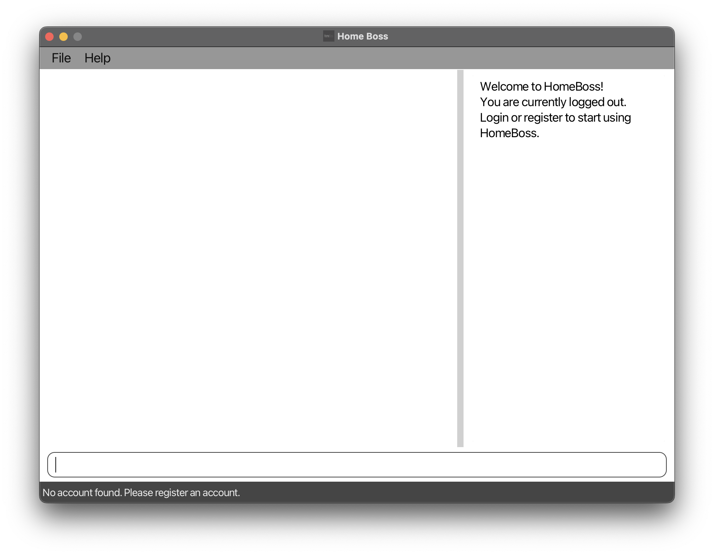
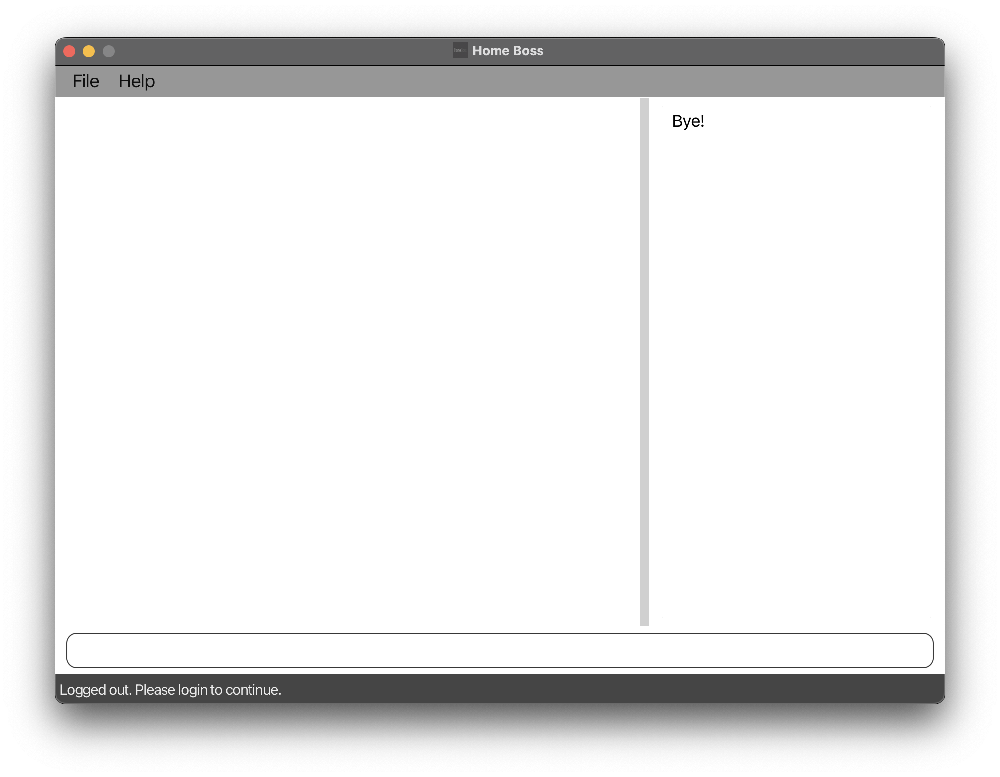
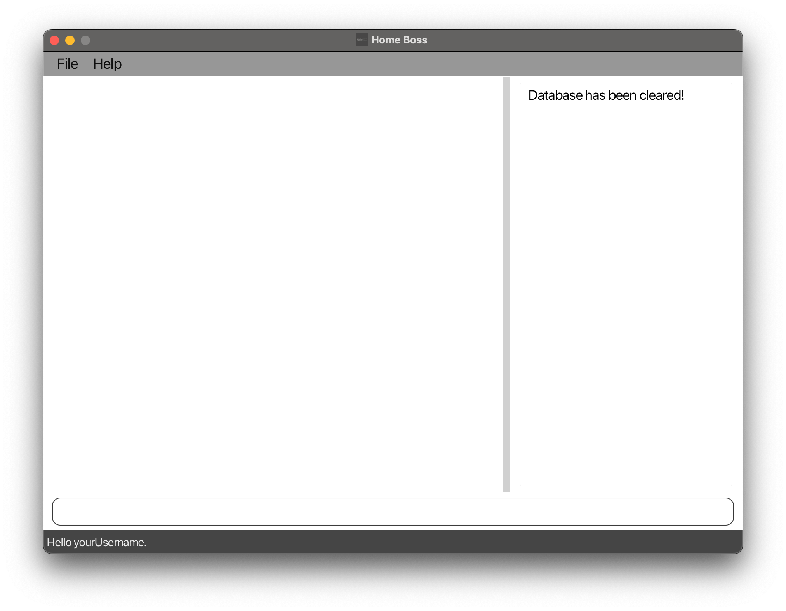

# User Guide for HomeBoss

This comprehensive user guide is your key to a seamless start with our cutting-edge software designed specifically for
home-based businesses. Our solution is tailored to enhance the efficiency of managing delivery addresses, simplifying
your operations.

---

## About this User Guide

This user guide provides you with everything that you need to know when using HomeBoss.

If you are new to HomeBoss, head over to the [Quick Start Guide](#quick-start-guide) section for a quick overview
on how to get started.

Additionally, this user guide provides you with detailed explanations of all the features available
in the [Features](#features) section.

For experienced users, you may refer to the [Command Summary](#command-summary) section for a quick summary of all the
commands available in HomeBoss.

If you would like to learn about the technical aspects of HomeBoss,
you may refer to the [Developer Guide](./DeveloperGuide.md).

### Navigating the User Guide

**Note Box**
<box background-color="#dff0d8" border-color="#d6e9c6" type="info" header="Note">
Provides you with information that is useful to know.
</box>

**Tip Box**
<box background-color="#d9edf7" border-color="#bce8f1" type="tip" header="Tip">
Provides you with information that can help enhance your user experience but is not necessary to know.
</box>

**Warning Box**
<box background-color="#f2dede" border-color="#ebccd1" type="warning" header="Warning">
Important information for you to take note of to avoid any unintended effects!
</box>

**Links**

* Words in blue are [links](#navigating-the-user-guide) that you can click on to navigate to the relevant section.

* A [&uarr; Back to Table of Contents](#table-of-contents) link is available at the end of every section
  for you to return to the Table of Contents, so that you can access another section from there easily.

---

# Table of Contents

- Getting Started
- Features
    - User
        - [Register](#register)
        - [Login](#login)
        - [Update details](#update-details)
        - [Logout](#logout)
        - [Account recovery](#account-recovery)
        - [Account deletion](#account-deletion)
    - Customer
        - [Add customer](#add-a-customer)
        - [Find customers](#find-customers)
        - List customers
        - Update customer details
        - [Delete customer](#delete-customer)
    - Delivery
        - Create delivery
        - View all deliveries
        - View details of deliveries
        - Update delivery status and date
        - Delete delivery
        - Create a note for a delivery
        - View deliveries for the day [Coming Soon]
        - Add customer data to delivery [Coming Soon]
        - Remove customer from delivery [Coming Soon]
        - Look up delivery details [Coming Soon]
    - Miscellaneous
        - [Help](#help)
        - [Exit](#exit)
        - [Clear](#clear)
- Troubleshooting / FAQ

---

# Getting Started

To get started, you will need to create an account and download the software. Once you have done that, you can follow
the instructions in the Getting Started Guide to start using the software.

---

# Command Summary

Here is a brief introduction to the commands that you will be using in HomeBoss. For more detailed information, please
refer to the [Features](#features) section.

### User

_These are commands for managing your user account in HomeBoss._

- `register` - Registers a new user account to use HomeBoss.
- `login` - Logs in to your user account.
- `update` - Updates your user account details.
- `logout` - Logs out of your user account.
- `recover account` - Recovers your user account.
- `delete account` - Deletes your user account.

### Customer

_These are commands for managing your customers in HomeBoss._

- `customer add` - Adds a customer to the address book.
- `customer find` - Finds customers whose names contain any of the given keywords.
- `customer list` - Lists all customers in the address book.
- `customer edit` - Updates the details of an existing customer in the address book.
- `customer delete` - Deletes the specified customer from the address book.

### Delivery

_These are commands for managing your deliveries in HomeBoss._

- `delivery add` - Adds a delivery to the delivery book.
- `delivery list` - Lists all deliveries in the delivery book.
- `delivery view` - Shows the details of the specified delivery.
- `delivery status` - Changes the status of a specified delivery.
- `delivery note` - Creates a note for a specified delivery.
- `delivery delete` - Deletes the specified delivery from the delivery book.

### Miscellaneous

_These are general commands for using HomeBoss._

- `help` - Shows a list of commands and their usage.
- `exit` - Exits the program.
- `clear` - Clears both customer and delivery database. **Warning:** This action is irreversible.

---

# Features

\*[ ] specifies optional fields

## User

### Register

> Registers a new user account to use HomeBoss.

_Want to get started? Start by registering for an account to use HomeBoss! Note that only one account can be registered
at a time._

**Format:
** `register --user USERNAME --password PASSWORD --confirmPass CONFIRM_PASSWORD --secretQn SECRET_QUESTION --answer ANSWER`

**Example:**

* `register --user gabriel --password gabrielIsGreat --confirmPass gabrielIsGreat --secretQn First pet's name? --answer Koko` -
  Registers a new user account with the username `gabriel`, password `gabrielIsGreat`, secret
  question `First pet's name?` and answer `Koko`.

<box background-color="#dff0d8" border-color="#d6e9c6" type="info" header="Note">
    * All fields are required.
    * The username must be unique.
    * The password must be at least 8 characters long.
    * The secret question and answer will be used for account recovery.
</box>

**Before:**

**After:**

[&uarr; Back to Table of Contents](#table-of-contents)

### Login

> Logs in to your user account.

_Want to access your data in HomeBoss? You can log in to your account by calling this command.
Note that you need to have an account registered with HomeBoss._

**Format:** `login --user USERNAME --password PASSWORD`

<box background-color="#dff0d8" border-color="#d6e9c6" type="info" header="Note">
    All fields are required.
</box>

**Example:**

* `login --user gabriel --password gabrielIsGreat` - Logs in to the user account with the username `gabriel` and
  password `gabrielIsGreat`.

**Before:**

**After:**

[&uarr; Back to Table of Contents](#table-of-contents)

### Update details

> Updates your user account details.

Want to keep your account secure? You can update your account details by calling this command.

**Format:** `update [--user USERNAME] [--password PASSWORD --confirmPass CONFIRM_PASSWORD]
[--secretQn SECRET_QUESTION --answer ANSWER]`

<box background-color="#dff0d8" border-color="#d6e9c6" type="info" header="Note">
    * [] around a group of parameters indicates that it is optional, but all parameters within the group must be provided.
    * At least one of the optional fields must be provided.
    * If PASSWORD is provided, CONFIRM_PASSWORD must also be provided, vice versa.
    * If SECRET_QUESTION is provided, ANSWER must also be provided, vice versa.
    * The details will be updated without checking against the current details.
</box>

**Example:**

* `update --user gabrielV2 --password gabrielIsBest --confirmPass gabrielIsBest
  --secretQn Favourite Pet --answer BoBo` - Updates the username to `gabrielV2`, password to `gabrielIsBest`, secret
  question to `Favourite Pet` and answer to `BoBo`.

**Before:**

**After:**

[&uarr; Back to Table of Contents](#table-of-contents)

### Logout

> Logs out of your user account.

_Want to keep your data secure at the end of the day? You can log out of your account by calling this command._

**Format:** `logout`

**Before:**

**After:**

[&uarr; Back to Table of Contents](#table-of-contents)

### Account Recovery

> Recovers the user account.

_Forgot your password? Use this command to recover your account!_

**Format:** `recover account [--answer ANSWER --password NEW_PASSWORD --confirmPass CONFIRM_PASSWORD]`

**Examples:**

* `recover account` - Displays your account's secret question for account recovery.
* `recover account --answer Koko --password newPassword123 --confirmPass newPassword123` - Recovers the account with the
  answer `Koko` and sets the new password to `newPassword123`.

<box background-color="#dff0d8" border-color="#d6e9c6" type="info" header="Note">
    * If ANSWER is provided, NEW_PASSWORD and CONFIRM_PASSWORD must also be provided, vice versa.
    * The passwords must be at least 8 characters long.
</box>

**After (without optional fields):**

**After (with optional fields):**

[&uarr; Back to Table of Contents](#table-of-contents)

### Account Deletion

> Deletes the user account.

_Want to delete your account? Call this command to delete your account and clear all your data._

<box background-color="#d9edf7" border-color="#bce8f1" type="tip" header="Tip">
    This command is useful only as a last resort, should you forget your password and secret answer. However, if you
    forgot your password but remember the answer to your secret question, you can call `recover account` [here](#account-recovery)
    instead.
</box>

**Format:** `delete account`

**Before:**

**After:**

[&uarr; Back to Table of Contents](#table-of-contents)

## Customer

### Add a customer

> Adds a customer to the address book.

_Did you just receive a new customer? You can add the customer's details into HomeBoss with this command._

**Format:** `customer add --name NAME --phone PHONE_NUMBER --email EMAIL --address ADDRESS`

<box background-color="#dff0d8" border-color="#d6e9c6" type="info" header="Note">
    * All fields are required.
    * HomeBoss does not allow you to add customers with the same phone number.
</box>

**Example:**

* `customer add --name Gabriel --phone 87654321 --email gabrielrocks@gmail.com --address RVRC Block B` - Adds a customer
  with the name `Gabriel`, phone number `87654321`, email `gabrielrocks@gmail.com` and address `RVRC Block B`.

**Before:**

**After:**

[&uarr; Back to Table of Contents](#table-of-contents)

### Find customers

> Finds customers whose names contain _ANY_ of the given keywords.

_Want to find details of a customer, but you do not remember the customer's full name?
You can search for the customer using keywords by calling this command._

**Format:** `customer find KEYWORD [MORE_KEYWORDS]`

<box background-color="#dff0d8" border-color="#d6e9c6" type="info" header="Note">
    You must provide at least one keyword to search for the customer.
</box>

**Example:**

* `customer find Gabriel Spencer` - Finds customers whose names contain _ANY_ of the given keywords `Gabriel`
  and `Spencer`.

**Before:**

**After:**

[&uarr; Back to Table of Contents](#table-of-contents)

### List customers

Lists all the customers added in the address book.

**Format:** `customer list`

**Example:**

* `customer list`

**Accepted Values:**

_NIL_

**Command succeeds (>0 customers):**

**Command succeeds (0 customer):** _There are currently no customers!_

_Details coming soon..._

### Update customer details

Updates the personal details of an existing customer in the address book.

**Format:** `customer edit CUSTOMER_ID [--name NAME] [--phone PHONE_NUMBER] [--email EMAIL] [--address ADDRESS]`

**Example:**

* `customer edit 1001 --name Gabriel -–phone 1234 5678 --email gabrielSoCool@gmail.com --address RVRC Block B Ben's Room`

**Accepted Values:**

_NAME_: String

_PHONE_NUMBER_: 8 digit Integer

_EMAIL_: String with @ and . in valid email format

_ADDRESS_: String

_CUSTOMER_ID_: Integer

*At least one of the optional fields must be provided.

**Command succeeds:** _Customer 1, Gabriel has been updated!_

**Command fails (missing_index):** _Please specify the customer to update._

**Command fails (invalid_index):** _The customer does not exist!_

**Command fails (missing_fields):** _Please provide at least one field to update!_

### Delete customer

> Deletes the specified customer from the customer database. All deliveries associated with the customer will also be
> deleted.

_Want to delete a customer? Call this command to delete a customer from the customer database._

**Format:** `customer delete CUSTOMER_ID`

**Example:**

* `customer delete 1` - Deletes the customer with ID 1.

**Before:**

**After:**

[&uarr; Back to Table of Contents](#table-of-contents)

## Delivery

### Add delivery

Adds a delivery to the delivery book.

**Format:** `delivery add DELIVERY_NAME --customer CUSTOMER_ID --date DELIVERY_DATE`

**Example:**

* `delivery add furniture --customer 5 --date 2023-12-03`

**Accepted Values:**

_DELIVERY_NAME:_ String of 50 characters

_CUSTOMER_ID:_ Integer

_DELIVERY_DATE:_ Delivery Date String in yyyy-MM-dd format or `today` for today’s date

**Command succeeds:** _Delivery [1001] furniture created successfully for Customer 1, Gabriel!_

**Command fails (missing_fields):** _Please fill up all the required fields (DELIVERY_NAME --customer CUSTOMER_ID --date
DELIVERY_DATE)!_

**Command fails (invalid_date):** _Delivery Date cannot be before today!_

**Command fails (invalid_date_format):** _Please provide the date in the format: yyyy-MM-dd._

### View all deliveries

Shows a list of all deliveries.

**Format:** `delivery list [--status STATUS] [--customer CUSTOMER_ID] [--date DELIVERY_DATE]  [--sort SORT]`

**Example:**

* `delivery list --status created --customer 1 --date 2023-12-12 --sort desc`

**Accepted Values:**

_STATUS_: CREATED/SHIPPED/COMPLETED/CANCELLED. If unspecified, defaults to show all deliveries.

_CUSTOMER_ID_: Integer

_DELIVERY_DATE_: Delivery Date String in yyyy-MM-dd format or `today` for today’s date

_SORT_: String of either `asc` for ascending or `desc` for descending or defaults to sort by delivery date.

**Command succeeds (>0 deliveries):**

**Command failed (0 deliveries):** _There are currently no deliveries!_

### View details of deliveries

Shows the details of the specified delivery.

**Format:** `delivery view DELIVERY_ID`

**Example:**

* `delivery view 1001`

**Accepted Values:**

_DELIVERY_ID_: Integer

**Command succeeds:**

**Command failed (0 deliveries):** _There are currently no deliveries._

### Look up delivery details `[Coming Soon in v1.3]`

_Details coming soon..._

### Update delivery status

Changes the status of a specified delivery

**Format:** `delivery status STATUS CUSTOMER_ID`

**Example:**

* `delivery status completed 2`

**Accepted Values:**

_STATUS:_ Either `CREATED`/`SHIPPED`/`COMPLETED`/`CANCELLED`

_CUSTOMER_ID:_ Integer

**Command succeeds:**

**Command fails (invalid_status):** _Delivery Status should be one of CREATED, SHIPPED, COMPLETED, CANCELLED_

**Command fails (invalid_index):** _The delivery index provided is invalid_

**Command fails (missing_fields):**

_Invalid command format!_ 
_delivery status: Edits the status of the delivery identified by the ID of the delivery. Existing status will be
overwritten by the input status._ 
_Parameters: STATUS (must be one of CREATED/SHIPPED/COMPLETED/CANCELLED) ID (must be a integer representing a valid
ID)_ 
_Example: delivery status COMPLETED 1_ 

#### Update delivery details

Updates the delivery details of an existing delivery in the delivery book.

**Format:** `delivery edit DELIVERY_ID [--name DELIVERY_NAME] [--customer CUSTOMER_ID] [--date DELIVERY_DATE]
[--status STATUS] [--note NOTE]`

**Example:**

* `delivery edit 1001 --name Chocolate Cake --customer 2 --date 2024-12-12 --status CANCELLED --note
  Customer changed his mind.`

**Accepted Values:**

_DELIVERY_ID:_ Integer

_DELIVERY_NAME:_ String

_CUSTOMER_ID:_ Integer

_DELIVERY_DATE:_ Delivery Date String in yyyy-MM-dd format or `today` for today’s date

_STATUS:_ Either `CREATED`/`SHIPPED`/`COMPLETED`/`CANCELLED`

_NOTE:_ String

**Command succeeds:**
//TODO: Add image

**Command fails (missing_index):** _Invalid command format!_

**Command fails (invalid_index):** _The delivery index provided is invalid_

**Command fails (missing_fields):** _Please provide at least one field to update!_

### Create a note for a delivery

Creates a note for a specified delivery

**Format:** `delivery note DELIVERY_ID --note NOTE`

**Example:**

* `delivery note 1 --note By FedEx`

**Accepted Values:**

_DELIVERY_ID_: Integer

_NOTE_: Nonempty alphanumeric string

**Command succeeds:**

**Command failed (invalid_index):** _The delivery index provided is invalid_

**Command failed (invalid_note):** _Note should not be empty_

**Command failed (missing_fields):**

_Invalid command format!_ 
_delivery note: Adds a note to the delivery identified by the ID of the delivery. Existing note if any will be replaced
with the input note._ 
_Parameters: DELIVERY_ID (must be a integer representing a valid ID) --note Note_ 
_Example: delivery note 1 --note This is a note_ 

### Add customer data to delivery `[Coming Soon in v1.3]`

_Details coming soon..._

### Delete delivery

Deletes the specified delivery.

**Format:** `delivery delete DELIVERY_ID`

**Example:**

* `delivery delete 1001`

**Accepted Values:**

_DELIVERY_ID_: Integer

**Command succeeds:** _Delivery [1001] Gabriel’s Milk deleted!_

**Command failed (delivery_id missing):** _Please specify a delivery id to delete!_

**Command failed (delivery_id not in database):** _This delivery does not seem to exist!_

### Remove customer from delivery `[Coming Soon in v1.3]`

_Details coming soon..._

## Miscellaneous

### Help

> Shows a list of commands and their usage.

_Want to know what commands are available in HomeBoss? You can view a summary of the commands available, the format
of the commands, and a link to this user guide by calling this command._

**Format:** `help`

<box background-color="#d9edf7" border-color="#bce8f1" type="tip" header="Tip">
    You can access this command anytime when using the application, even when you are not logged in.
</box>

**Before:**

**After:**

[&uarr; Back to Table of Contents](#table-of-contents)

### Exit

> Exits the program.

_Want to exit HomeBoss? You can exit the program by calling this command._

**Format:** `exit`

<box background-color="#dff0d8" border-color="#d6e9c6" type="info" header="Note">
    If you are logged in, this command will automatically log you out of your account and close the application.
</box>

[&uarr; Back to Table of Contents](#table-of-contents)

### Clear

> Clears both customer and delivery database.

_Need to clear your customer and delivery data?
You can delete all your customer and delivery data by calling this command._

**Format:** `clear`

<box background-color="#f2dede" border-color="#ebccd1" type="warning" header="Warning">
    This action is irreversible! All your customer and delivery data will be deleted permanently. Proceed with caution.
</box>

**Before:**

**After:**

[&uarr; Back to Table of Contents](#table-of-contents)
